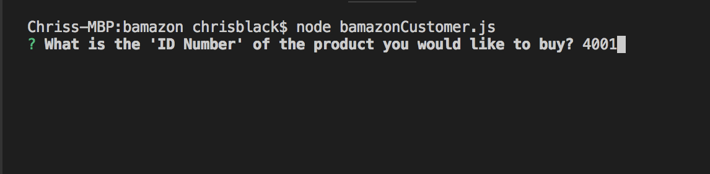
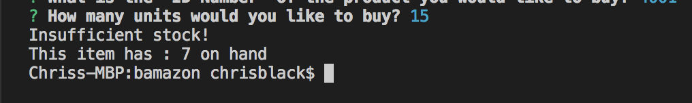

# bamazon

"Bamazon" is a CLI app that demonstrates my knowledge of using a MySQL Database, JavaScript, and Node.js.  It is essentially a store front where the "user" enters their order and the app checks if what they want is in stock.  If it is, the app "places" their order, if not, it tells them of the current stock on hand.  

The app useses the npm "inquirer" to ask the user the question "What is the 'ID Number' of the product you would like to buy?". Below, we're entering 4001 for tooth brushes. 

You can see here that we've asked to order 15, but there are currently only a total of 7 on hand. 

If we choose an amount that is in stock, the app totals our order for us, logs it, then updates the database with the amount remaining. The price is saved in the database relative to the item that is being purchased.  In this case, the toothbrush is $10.95.

![picture] (images/orderPlaced.png)

